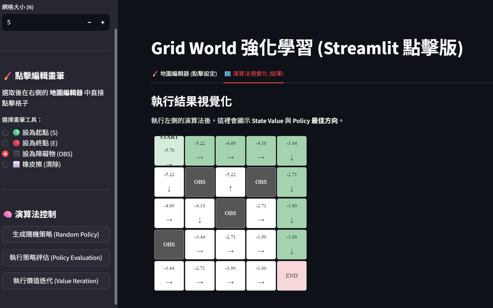

# Grid World 強化學習 (Streamlit 版)

這是一個基於 Streamlit 開發的網格地圖 (Gridworld) 強化學習互動展示專案，包含了**隨機策略評估**與**價值迭代**的最佳路徑視覺化功能。

## 專案功能特色
- **自訂網格環境**：可以設定 3x3 到 20x20 大小的網格。
- **點擊式地圖編輯器**：輕鬆點擊設定起點 (S)、終點 (E)、障礙物 (OBS) 等。
- **策略評估 (Policy Evaluation)**：對隨機生成的行動策略計算狀態價值 V(s)。
- **最佳價值迭代 (Value Iteration)**：計算出全域最佳狀態價值，並自動導出最佳行動策略。
- **最短路徑高亮顯示**：執行價值迭代後，程式將自動運算出從起點走到終點的最短有效路徑，並於結果網格中以明顯綠色高亮標示出該路徑。

## 如何安裝與執行

此專案依賴 `streamlit` 框架，請確保你在正確的 Python 版本中執行：

**1. 安裝必要套件：**
```bash
pip install -r requirements.txt
```
*(或是直接使用 `pip install streamlit`)*

**2. 啟動伺服器：**
若有建立虛擬環境，請確認已經 Activate。請在專案目錄下執行以下指令：
```bash
python -m streamlit run streamlit_app.py
```

**3. 開始使用：**
開啟命令列提示的網址（通常為 `http://localhost:8501`），即可在瀏覽器中看見圖形化操作介面。

## 介面操作說明
1. 在左側欄位設定你想測試的**網格大小 (N)**。
2. 在左側邊欄選擇你要放置的圖示工具（起點、終點或障礙物），並在主要畫面的「地圖編輯器」分頁中點擊方格來編輯地圖配置。
3. 點擊左下方演算法區塊的按鈕，例如「執行價值迭代 (Value Iteration)」。
4. 點選上方「🗺️ 演算法視覺化 (結果)」的頁籤，即可看見帶有箭頭方向、狀態價值以及經過顏色高亮表示的最短路徑圖。

## 執行截圖結果
*(下圖展示了進行價值迭代後，以顏色標記出的最佳無障礙路徑)*


